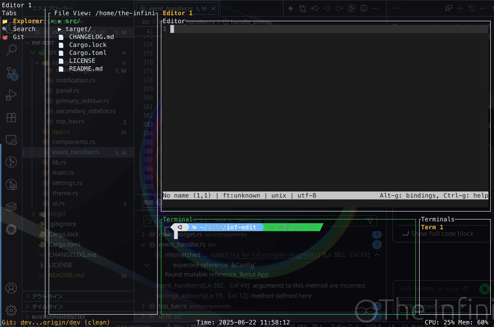

# inf-edit

`inf-edit`は、Rust製のターミナルベースのテキストエディタ兼ファイラです。  
エディタ、ターミナル、ファイルビューを統合したTUIアプリケーションです。

## 特徴

- **ファイルビュー**  
  ディレクトリ階層をツリー表示し、ファイルやフォルダの移動・選択が可能です。
- **エディタ**  
  `$EDITOR`（例: vi, nano など）を使ってファイルを編集できます。
- **ターミナル**  
  統合ターミナルでシェル操作が可能です。
- **キーボード操作**  
  すべての操作をキーボードで完結できます。

## キーバインド

| キー             | 機能                       |
|------------------|----------------------------|
| Ctrl+Q           | 終了                       |
| Ctrl+B           | ファイルビューの表示/非表示 (Primary Sidebar) |
| Ctrl+J           | ターミナルの表示/非表示     |
| Ctrl+K           | エディタ/ターミナル切替     |
| Ctrl+N           | 新しいタブを開く (フォーカスに応じてエディタ/ターミナル) |
| Ctrl+P           | コマンドパレットの表示/非表示 |
| Ctrl+W           | アクティブなタブを閉じる    |
| Ctrl+Shift+N     | (Konsoleとの競合のため削除) |
| Alt+H, Alt+L     | エディタ/ターミナルタブの切替 |
| Ctrl+Tab, Ctrl+Shift+Tab | プライマリサイドバーのタブ切替 |
| ↑/↓, j/k         | ファイルビュー上下移動      |
| ↑/↓              | 設定エディタの項目移動      |
| Enter            | ディレクトリ移動/ファイル編集|
| Ctrl+Shift+↑/↓   | ターミナルタブの切替      |
| Backspace, h     | 1つ上のディレクトリに戻る   |
| Ctrl+Alt+B       | ヘルプの表示/非表示 (Secondary Sidebar) |

## ビルド・実行

```sh
cargo build --release
cargo run --release
```

## 依存クレート

- [ratatui](https://crates.io/crates/ratatui)
- [portable-pty](https://crates.io/crates/portable-pty)
- [walkdir](https://crates.io/crates/walkdir)
- [tui-term](https://crates.io/crates/tui-term)
- [crossterm](https://crates.io/crates/crossterm)

## スクリーンショット



## ライセンス

MIT

---

ご意見・プルリクエスト歓
